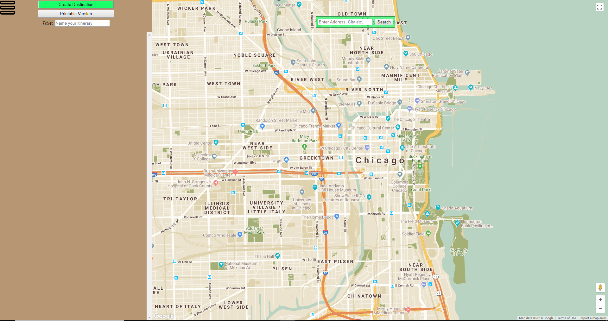
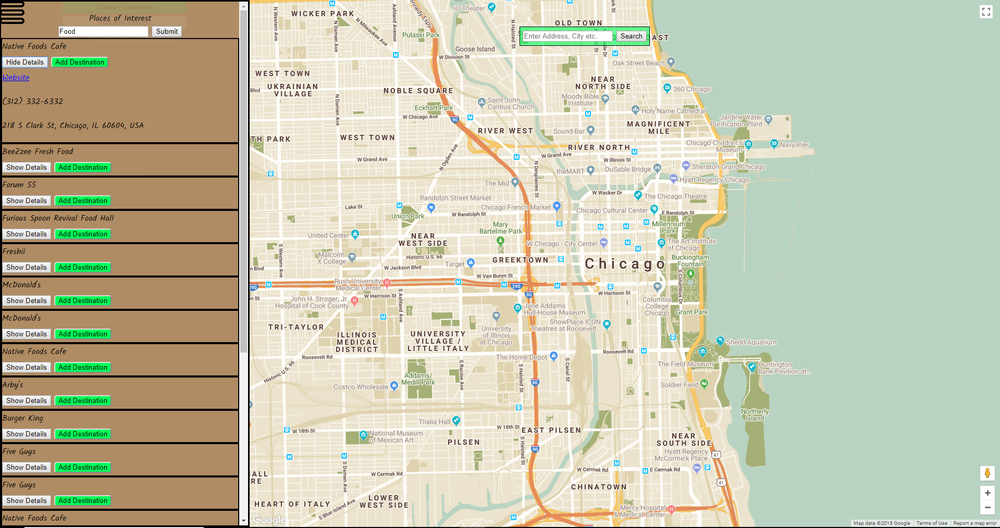

# myItinerary

myItinerary allows you to search an area for locations using google places api and add them to an itinerary which can be viewed in a stylized, printable screen.  

## Live Link

https://tesuji09.github.io/MyItinerary/

## Screenshoots
Introduction Page:

Destination sidebar:

Places search sidebar:

## Technologies Used

* HTML
* CSS
* jQuery
* JavaScript
* Bootstrap
